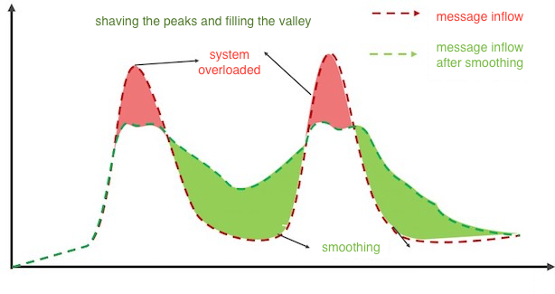
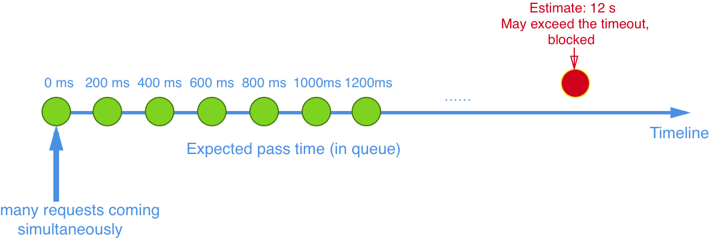

# Sentinel: The flow sentinel of Apache RocketMQ

In Apache RocketMQ, when message consumers are consuming messages, there may a sudden inflow of messages, whether using pull or push mode. If all the messages were handled at this time, it would be likely to cause the system to be overloaded and then affect stability. However, in fact, there may be no messages coming within a few seconds. If redundant messages are directly discarded, the system's ability to process the message is not fully utilized. We hope that the sudden inflow of messages can be spread over a period of time, so that the system load can be kept on the stable level while processing as many messages as possible, thus achieving the effect of “shaving the peaks and filling the valley”.

 

The red part in the above figure represents the part that exceeds the message processing capability. We can see that the message surge is often instantaneous and irregular, and the system will have idle resources after some time. We hope that the red part of the messages can be handled when there are idle resources available, so that the system load can be guaranteed to be at a stable water level, and more messages can be processed as much as possible. In this scanerio, we need a powerful library - Sentinel, to protect the RocketMQ client.

## How Sentinel smoothes the message inflow

### Introduction to Sentinel

[Sentinel](https://github.com/alibaba/Sentinel) is a powerful library opensourced by Alibaba Middleware Team. Sentinel takes "**flow**" as the breakthrough point, and covers multiple fields including flow control, concurrency, circuit breaking and load protection to protect service stability.

### How it works

Sentinel provides a feature for this kind of scenario: [Rate Limiter](https://github.com/alibaba/Sentinel/wiki/Flow-Shaping:-Pace-Limiter), which can spread a large number of sudden request inflow in a uniform rate manner, let the request pass at a fixed interval. It is often used to process burst requests instead of rejecting them. This avoids traffic spurs causing system overloaded. Moreover, the pending requests will be queued and processed one by one. When the request is estimated to exceed the maximum queuing timeout, it will be rejected immediately.

For example, we configure the rule with uniform rate limiting mode and QPS count is 5, which indicates messages are consumed at fixed interval (200 ms) and pending messages will queue. We also set the maxium queuing timeout is 5s, then all requests estimated to exceed the timeout will be rejected immediately.

 

### Sample using RocketMQ Client with Sentinel

When using RocketMQ Client with Sentinel, we need to add the following dependency to `pom.xml` (in Maven):

```xml
<dependency>
    <groupId>com.alibaba.csp</groupId>
    <artifactId>sentinel-core</artifactId>
    <version>x.y.z</version>
</dependency>
```

We need to manually wrap our code of handling messages with Sentinel API. We can set rules to different groups and topics (e.g. resouceName is `groupName:topicName`), set the control behaviour to `RuleConstant.CONTROL_BEHAVIOR_RATE_LIMITER`, then the messages can be handled at a fixed rate. Here is an example for the rule:

```java
private void initFlowControlRule() {
    FlowRule rule = new FlowRule();
    rule.setResource(KEY); // resource name can be `groupName:topicName`
    rule.setCount(5); // Indicates the interval between two adjacent requests is 200 ms.
    rule.setGrade(RuleConstant.FLOW_GRADE_QPS);
    rule.setLimitApp("default");

    // Enable rate limiting (uniform). This can ensure fixed intervals between two adjacent calls.
	// In this example, intervals between two incoming calls (message consumption) will be 200 ms constantly.
    rule.setControlBehavior(RuleConstant.CONTROL_BEHAVIOR_RATE_LIMITER);
    // If more requests are coming, they'll be put into the waiting queue.
    // In this example, the max timeout is 5s.
    rule.setMaxQueueingTimeMs(5 * 1000);
    FlowRuleManager.loadRules(Collections.singletonList(rule));
}
```

Then we wrap logic of handling messages with Sentinel API:

```java
// Pull consumer
PullResult pullResult = consumer.pullBlockIfNotFound(mq, null, getMessageQueueOffset(mq), 32);
if (pullResult.getMsgFoundList() != null) {
    for (MessageExt msg : pullResult.getMsgFoundList()) {
        // Handle the message
        doSomething(msg);
    }
}

long nextOffset = pullResult.getNextBeginOffset();
putMessageQueueOffset(mq, nextOffset);
consumer.updateConsumeOffset(mq, nextOffset);
```

```java
private static void doSomething(MessageExt message) {
    pool.submit(() -> {
        Entry entry = null;
        try {
            ContextUtil.enter(KEY);
            entry = SphU.entry(KEY, EntryType.OUT);

            // Handle the message here.
            System.out.printf("[%d][%s][Success: %d] Receive New Messages: %s %n", System.currentTimeMillis(),
                Thread.currentThread().getName(), successCount.addAndGet(1), , new String(message.getBody()));
        } catch (BlockException ex) {
            // Blocked.
			// NOTE: When blocked, we need to decide whether to re-consume the message.
            System.out.println("Blocked: " + failCount.addAndGet(1));
        } finally {
            if (entry != null) {
                entry.exit();
            }
            ContextUtil.exit();
        }
    });
}
```

The entire code can be found in [PullConsumerDemo](https://github.com/alibaba/Sentinel/blob/master/sentinel-demo/sentinel-demo-rocketmq/src/main/java/com/alibaba/csp/sentinel/demo/rocketmq/PullConsumerDemo.java).

Now let's take a look at the effect. First we start RocketMQ broker and name server in local accroding to [RocketMQ Quick Start](https://rocketmq.apache.org/docs/quick-start/), then we send 1000 messages to a specific group and topic. After that, we configure the flow rules and start the consumer. We can see the fixed rate of consuming messages (every 200 ms):

```
[1532571650235][pool-1-thread-32][Success: 3] Receive New Messages: Hello RocketMQ From Sentinel 274 
[1532571650435][pool-1-thread-22][Success: 4] Receive New Messages: Hello RocketMQ From Sentinel 154 
[1532571650634][pool-1-thread-7][Success: 5] Receive New Messages: Hello RocketMQ From Sentinel 72 
[1532571650833][pool-1-thread-31][Success: 6] Receive New Messages: Hello RocketMQ From Sentinel 262 
[1532571651035][pool-1-thread-30][Success: 7] Receive New Messages: Hello RocketMQ From Sentinel 250 
[1532571651235][pool-1-thread-8][Success: 8] Receive New Messages: Hello RocketMQ From Sentinel 84 
[1532571651435][pool-1-thread-4][Success: 9] Receive New Messages: Hello RocketMQ From Sentinel 36 
[1532571651635][pool-1-thread-5][Success: 10] Receive New Messages: Hello RocketMQ From Sentinel 48 
[1532571651835][pool-1-thread-1][Success: 11] Receive New Messages: Hello RocketMQ From Sentinel 0 
```

At the same time, there are queuing tasks completed continuously. Requests estimated to exceed the maximum queuing timeout are blocked immediately.

If uniform rate limiting mode is not enabled, only 5 messages will be processed at the same time while the rest will be blocked. The rest of requests cannot be processed even if the system resources are sufficient later, leading to the idle resources wasted.

### Sentinel Dashboard

For ease of use, Sentinel provides a Dashboard for configuring rules, viewing monitoring metrics, machine discovery, and more. We only need to start the dashborad according to the [Sentinel dashboard documentation](https://github.com/alibaba/Sentinel/wiki/Dashboard), then add the appropriate parameters to the corresponding application and launch it (the client also requires a transport dependency like `sentinel-transport-simple-http`). For example, the startup parameters of the message consumer in this article is:

```bash
-Dcsp.sentinel.api.port=8720 -Dcsp.sentinel.dashboard.server=localhost:8080 -Dproject.name=sentinel-rocketmq-consumer
```

After launching the message consumer demo, we can find our application in the Sentinel dashboard. It's convenient to configure the rules in the dashboard or view real-time monitoring metrics. Here is the metrics of uniform rate limiting mode (`b_qps` in the figure stands for blocked QPS):

 

Compare with the monitoring metrics in default flow control mode:

 

It can be seen that in default flow control mode, the system can only process a small number of messages simultaneously, while the rest are immediately blocked. In the uniform rate limiting mode, the surge portion can be smoothed to the later time, so more messages can be processed in each inflow of messages. The comparison of the two modes shows that the capability of message processing in the uniform rate limiting mode is better utilized.

## More

This blog post only introduces a common scenario in Sentinel - Uniform Rate Limiter. Sentinel can handle more complex scenarios like:

- **Flow Control**: Sentinel can control the traffic flow of resource calls based on different runtime metrics (such as QPS, number of threads, system load, etc.), for different invocation paths, and adjust random traffic to appropriate shapes (e.g. uniform speed).
- **Circuit Breaking**: When a resource in the invocation chain is unstable (average RT increase or exception ratio increase), Sentinel will fast-fail the call request for this resource to avoid affecting other resources, causing cascade failure.
- **System Load Protection**: Sentinel can be used to protect your server in case the system load goes too high. It helps you to achieve a good balance between system load and incoming requests.

For more scenarios, you can dig into [Sentinel Wiki](https://github.com/alibaba/Sentinel/wiki).